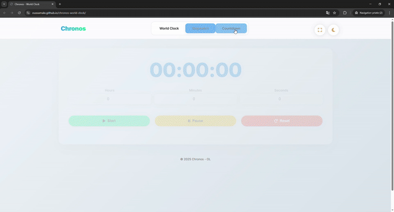
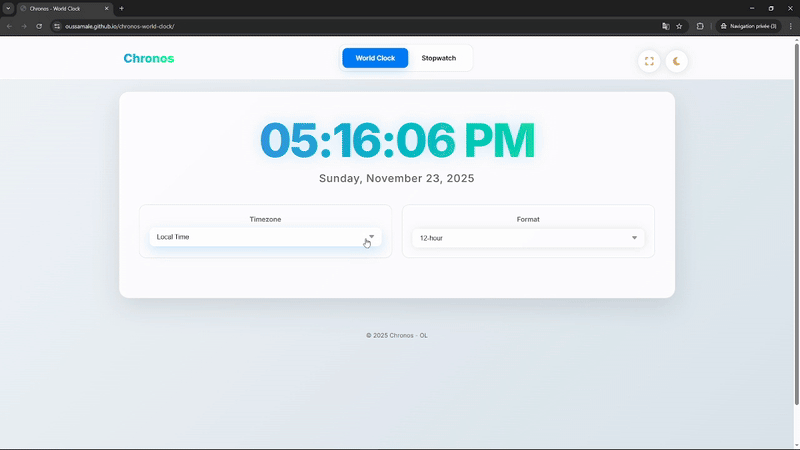

# Chronos – World Clock


A modern, responsive and interactive world‑clock application built with **HTML**, **CSS**, and **JavaScript** — featuring multiple timezones, 12/24‑hour format switching, light/dark theme transitions, a stopwatch with lap tracking and a countdown timer with visual alerts.

---

## Demo Preview

### Version 3 (Current)

<div align="center">
  
</div>

---

## Previous Versions

<details>
  <summary><strong>Version 1</strong></summary>
  <div align="center">
    
  </div>
</details>

<details>
  <summary><strong>Version 2</strong></summary>
  <div align="center">
    
  </div>
</details>


## Live Demo
You can check out Chronos in action : [Chronos Live Demo](https://oussamale.github.io/chronos-world-clock/).

---

## Features

### World Clock
- **Real-time updates** every second
- **6 timezones** covering major global cities (Local, UTC, EST, PST, London, Tokyo)
- **12/24-hour format** toggle
- **Date display** with full formatting
- **Automatic timezone conversion**

### Stopwatch
- **High precision timing** (00:00:00.00 format with hundredths of a second)
- **Start/Pause/Reset/Lap** controls
- **Lap tracking** with numbered history and scrollable container
- **Professional sports-style timing** interface
- **Real-time updates** every 10ms for accuracy

### Countdown Timer
- **Flexible time input** (hours, minutes, seconds)
- **Start/Pause/Reset** functionality
- **Visual time alerts** with color changes:
  - **Blue**: Normal time
  - **Yellow**: Last 30 seconds
  - **Red**: Last 10 seconds
- **Pulsing alert animation** when timer completes
- **Real-time preview** of set time
  
---

## Project Structure

```
chronos-world-clock/
│
├── index.html
├── README.md
├── css/
│   └── style.css
├── js/
│   └── app.js
└── assets/
    └── images/ 
        ├── demo_v1.gif
        ├── demo_v2.gif
        └── demo_v3.gif
```

---

## Getting Started

### 1. Clone the repository
```bash
git clone https://github.com/oussamale/chronos-world-clock.git
cd chronos-world-clock
```

### 2. Open the app
Mac:
```bash
open index.html
```
Windows:
```bash
start index.html
```
Linux:
```bash
xdg-open index.html
```

---


## Credits

Created by **Oussama**  

Feedback and contributions are always welcome!

---

## License

This project is open source and available under the [MIT License](LICENSE).

---

**⭐ Star this repository if you find Chronos useful !**

