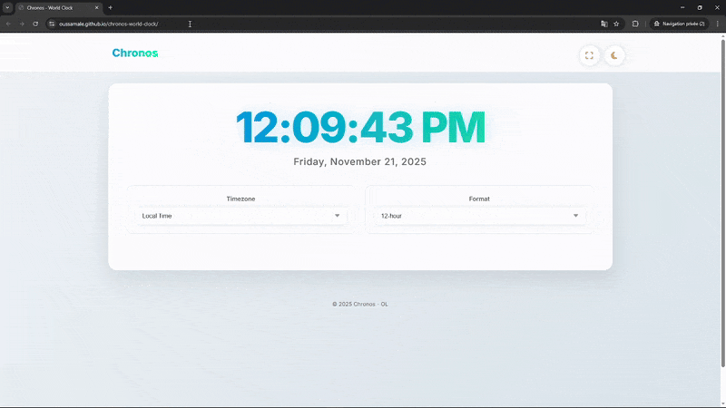

# Chronos – World Clock


A modern, responsive and interactive world‑clock application built with **HTML**, **CSS**, and **JavaScript** — featuring multiple timezones, 12/24‑hour format switching, and light/dark theme transitions.

---

## Demo Preview

<div style="text-align: center;">
  
</div>

## Live Demo
You can check out Chronos in action : [Chronos Live Demo](https://oussamale.github.io/chronos-world-clock/).

---

## Features

- Real‑time digital clock
- Timezone selection (Local, UTC, EST, PST, London, Tokyo)
- 12h / 24h format toggle
- Light/Dark theme switcher
- Fullscreen mode
- Responsive UI and animations

---

## Project Structure

```
chronos-world-clock/
│
├── index.html
├── README.md
├── css/
│   └── style.css
├── js/
│   └── app.js
└── assets/
    └── images/ 
        └── demo.gif
```

---

## Getting Started

### 1. Clone the repository
```bash
git clone https://github.com/oussamale/chronos-world-clock.git
cd chronos-world-clock
```

### 2. Open the app
Mac:
```bash
open index.html
```
Windows:
```bash
start index.html
```
Linux:
```bash
xdg-open index.html
```

---


## Credits

Created by **Oussama**  

Feedback and contributions are always welcome!

---

## License

This project is open source and available under the [MIT License](LICENSE).

---

**⭐ Star this repository if you find Chronos useful !**


